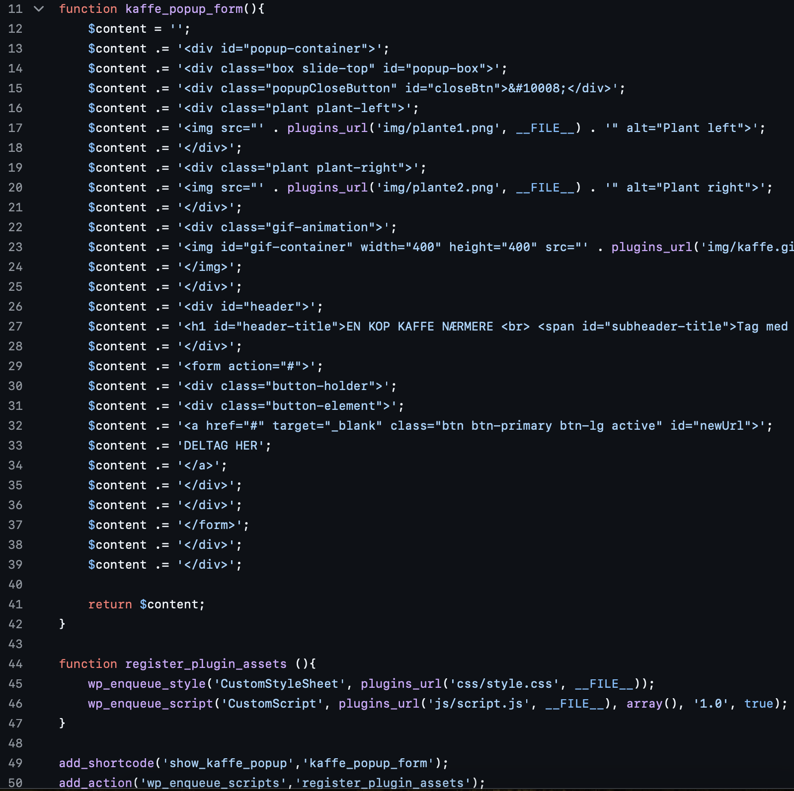
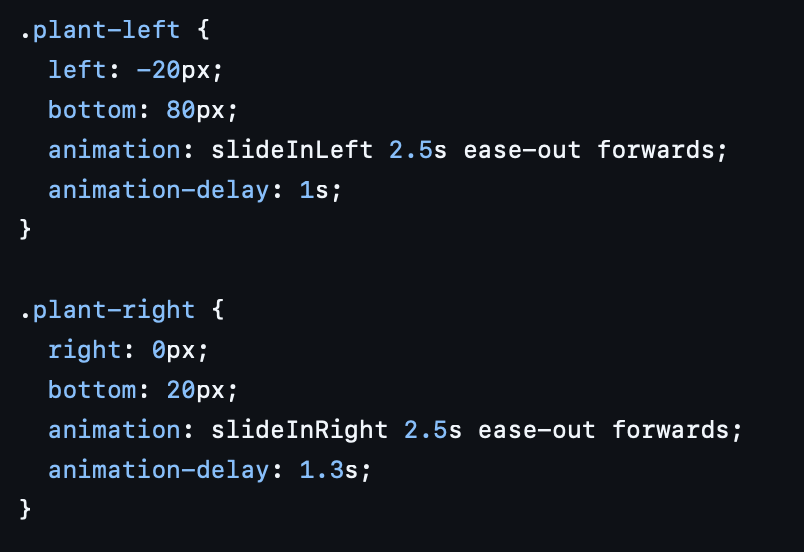
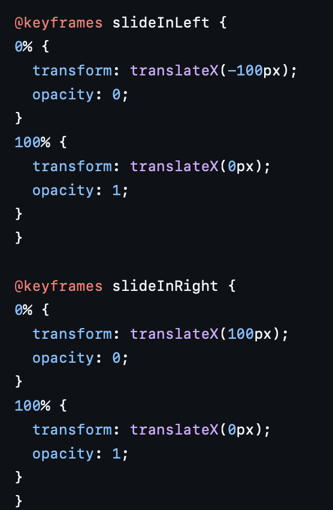
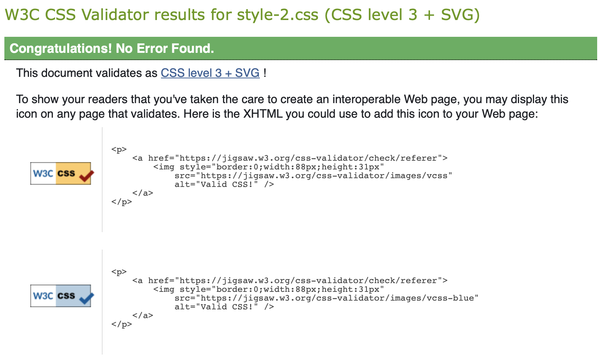
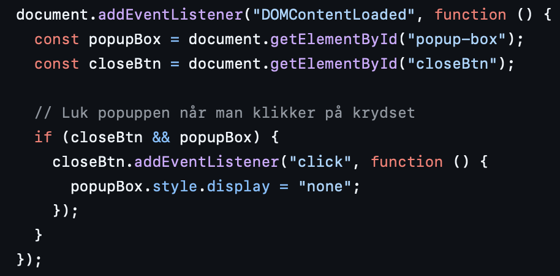

# Peter Larsen Kaffe popup plugin

Dette WordPress plugin er udviklet med henblik på vores vores gåtur kampagne event til Peter Larsen Kaffe.

Pluginnet viser en popup på forsiden med en kaffekop, nogle planter og en CTA, der leder brugeren til kampagnesiden.

---

## Opbygning
Pluginnet består af fire hovedelementer: **php**, **html**, **css**, **js**

### index.php

**index.php** er hovedfilen i pluginnet. Her er HTML'en opbygget i strenge med `$content =´´;`

`.=` sørger for at teksten i variablerne bliver sat fast på `$content` hvor HTML'en så kan blive bygget op linje for linje.

`register_plugin_asset` sørger for at indlæse min `style.css` og min `script.js`

`add_shortcode('show_kaffe_popup','kaffe_popup_form');` registrer pluginnet som en shortcode, så man nemt kan indsætte pluginnet min Wordpress side ved at skrive shortcoden `show_kaffe_popup` i min pagebuilder.

`add_action('wp_enqueue_scripts','register_plugin_assets');` Tilføjer en handling til Wordpress der indlæser css og js.

## style.css

I min popup har jeg nogle planter som er animeret med css til at bevæge sig ind fra siderne.

`transform: translateX()`bestemmer hvor og hvor langt planterne skal bevæge sig horizontalt
`opacity:` styrer gennemsigtigheden af billederne

Derudover har jeg denne animation som gør at selve popuppen slider opad når man loader ind på siden.

De ting i mit style.css som jeg havde problemer med fik jeg hjælp af ai til at rette.

ChatGPT, 2025, hjælp med at gøre popup sticky [online] fundet på:
https://chatgpt.com/s/t_691129d075ec81919014951d4f5e3ec9
[set 8-11-2025]

ChatGPT, 2025, hjælp med at rette css [online] fundet på:
https://chatgpt.com/s/t_69112a7ebe088191bd0a0dcf274f32d7
[set 8-11-2025]

Her har jeg valideret min `style.css`i en validator og fandt nul fejl.

## script.js

Her tilføjes en event listener som skal lytter efter en lukfunktion til luk-knappen, når man trykker på den. Popuppen skjules med `style.display = "none";`når man trykker på luk-knappen.